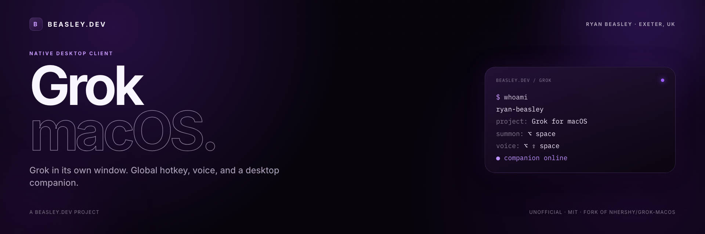

<p align="center">
  
</p>

<p align="center">
  <a href="https://beasley.dev"><strong>beasley.dev</strong></a>
  &nbsp;·&nbsp;
  <a href="https://github.com/RyanBeasley1994/Grok-macOS/releases">Releases</a>
  &nbsp;·&nbsp;
  <a href="#install">Install</a>
  &nbsp;·&nbsp;
  <a href="LICENSE">MIT</a>
</p>

<p align="center">
  
  
  
</p>

---

Native macOS client for [grok.com](https://grok.com) — Grok in its own window, or just a desktop companion you click to talk.

A [**beasley.dev**](https://beasley.dev) project by Ryan Beasley. Maintained fork of [nhershy/Grok-macOS](https://github.com/nhershy/Grok-macOS) by Nicholas Hershy.

> Unofficial. Not affiliated with, endorsed by, or connected to xAI. “Grok” is a trademark of xAI. This app wraps the grok.com website.

<p align="center">
  
</p>

## Features

| | |
|:---|:---|
| **Global hotkey** | <kbd>⌥ Space</kbd> anywhere to show or hide the chat window |
| **Voice hotkey** | <kbd>⌥⇧ Space</kbd> starts or stops voice **without** opening chat |
| **Desktop companion** | A draggable Grokling on the desktop. Click it to talk; it becomes a talking orb while voice is live |
| **In-mascot browser** | The Grokling keeps its own signed-in grok.com session, so voice runs there instead of raising the big window |
| **Settings** | Companion, size, shortcuts, login item, Dock / menu bar, microphone, “Hey Grok” · <kbd>⌘,</kbd> |
| **Menu bar mode** | Hide the Dock icon and keep the Grok logo in the menu bar |
| **Zoom** | <kbd>⌘−</kbd> / <kbd>⌘=</kbd> / <kbd>⌘0</kbd> — remembered between launches |
| **Native feel** | Real macOS file panels, Finder-revealed downloads, camera and mic for voice |
| **Sign-in** | Google sign-in works, which usually breaks in embedded web views |
| **Out of the way** | External links open in your browser; closing the window keeps Grok running |

No in-app tab strip. Chat is a single native window you open only when you want to type.

## How to use

### First launch

1. Open **Grok**.
2. Sign in on grok.com (Google, X, or Apple). That login is shared with the Grokling’s hidden session.
3. Allow the **microphone** the first time you start voice. macOS remembers it after that (see [Microphone](#microphone)).
4. Give the companion a few seconds after launch so grok.com can finish loading.

### Chat window

- **⌥ Space** — show or hide the chat window from anywhere.
- Type as you would on grok.com. There is no extra tab bar; the site is the whole window.
- **⌘ W** hides the window. The app stays running so the hotkey and Grokling still work.

### Voice (without opening chat)

Voice runs in the Grokling’s own grok.com page, not in the chat window.

| Do this | What happens |
|:---|:---|
| Click the Grokling | Starts or stops voice. Chat stays closed. |
| <kbd>⌥⇧ Space</kbd> | Same, from anywhere. |
| Right-click the Grokling | Start / stop voice, open chat, Settings, hide companion. |

While voice is live the Grokling plays the talking-orb animation. Click again to hang up.

Wait a couple of seconds after launch before the first click so the hidden page can hydrate.

### Desktop companion

- Drag it anywhere; the position is remembered.
- Hover perks its ears. Voice turns it into the orb.
- Size is a slider in Settings (60%–200%).
- Hide or show it from **Companion** in the menu, <kbd>⌘⇧ M</kbd>, or Settings.

### Settings

Open **Grok → Settings…**, press <kbd>⌘,</kbd>, use the Grokling’s context menu, or the menu-bar extra.

| Section | What you can change |
|:---|:---|
| **General** | Open at login. Hide the Dock icon and show the Grok logo in the menu bar. |
| **Microphone** | Current access (Allowed / Denied). Button to allow, or to open System Settings if blocked. |
| **Companion** | Show the Grokling. Mascot size. |
| **Voice** | Listen for **“Hey Grok”** (on-device). Status line tells you if speech or mic access is missing. |
| **Keyboard shortcuts** | Remap the global show/hide and voice hotkeys. Needs a modifier (⌘ ⌥ ⌃ ⇧). Reset to defaults. |

In **menu bar mode**, click the Grok logo in the menu bar for Open Grok, voice, companion, Settings, and Quit. The chat window does not open on launch in that mode.

### Microphone and speech

The app asks macOS for the **microphone** (voice) and, if you turn on “Hey Grok”, **speech recognition**. Click **Allow** once each.

1. Start voice or enable “Hey Grok”.
2. Check **Settings → Permissions** — both should say **Allowed**.
3. If you clicked Don’t Allow, use the Settings buttons to reopen System Settings and enable Grok.

Local installs are signed with a stable **Grok Local** identity (`scripts/sign-local.sh`) so those grants survive launches and rebuilds. An unsigned ad-hoc copy looks like a new app every time and will ask again.

## Keyboard shortcuts

| Shortcut | Action |
|:---|:---|
| <kbd>⌥ Space</kbd> | Show / hide the chat window (system-wide) |
| <kbd>⌥⇧ Space</kbd> | Start / stop voice without opening the window (system-wide) |
| <kbd>Esc</kbd> | Hang up while voice is live |
| <kbd>⌘⇧ M</kbd> | Show / hide the Grokling |
| <kbd>⌘ ,</kbd> | Settings |
| <kbd>⌘ W</kbd> | Close / hide the chat window |
| <kbd>⌘ N</kbd> | New chat |
| <kbd>⌘ R</kbd> | Reload |
| <kbd>⌘ [</kbd> / <kbd>⌘ ]</kbd> | Back / Forward |
| <kbd>⇧⌘ H</kbd> | Home |
| <kbd>⌘ −</kbd> / <kbd>⌘ =</kbd> / <kbd>⌘ 0</kbd> | Zoom out / in / reset |

Global shortcuts can be remapped in Settings. grok.com’s own **Enter voice mode** control is <kbd>⌘⇧ O</kbd> on the page; the Grokling uses that internally.

## Install

macOS 14 Sonoma or later.

Build from source, or download a DMG from [Releases](https://github.com/RyanBeasley1994/Grok-macOS/releases) once one is published. Open the DMG and drag **Grok** into **Applications**.

## Building from source

Requires Xcode 16 or later.

```sh
git clone https://github.com/RyanBeasley1994/Grok-macOS.git
cd Grok-macOS
open Grok-macOS.xcodeproj
```

Set your own development team under **Signing & Capabilities**, then build and run. Release packaging lives in `scripts/` — see [RELEASING.md](RELEASING.md).

## Credits

| | |
|:---|:---|
| This fork | [Ryan Beasley](https://beasley.dev) · [beasley.dev](https://beasley.dev) |
| Original app | [Nicholas Hershy](https://github.com/nhershy/Grok-macOS) |

See [NOTICE](NOTICE) for attribution.

## License

[MIT](LICENSE). Original copyright Nicholas Hershy, 2026. Subsequent modifications copyright Ryan Beasley, 2026.

<p align="center">
  <sub><a href="https://beasley.dev">beasley.dev</a> · Exeter, UK</sub>
</p>
